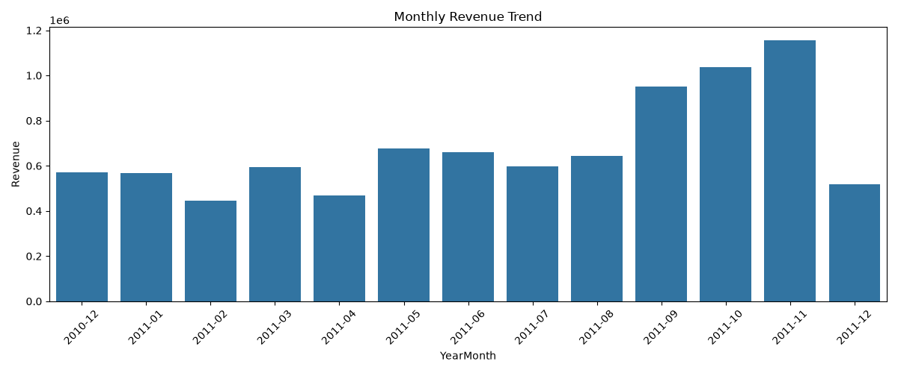
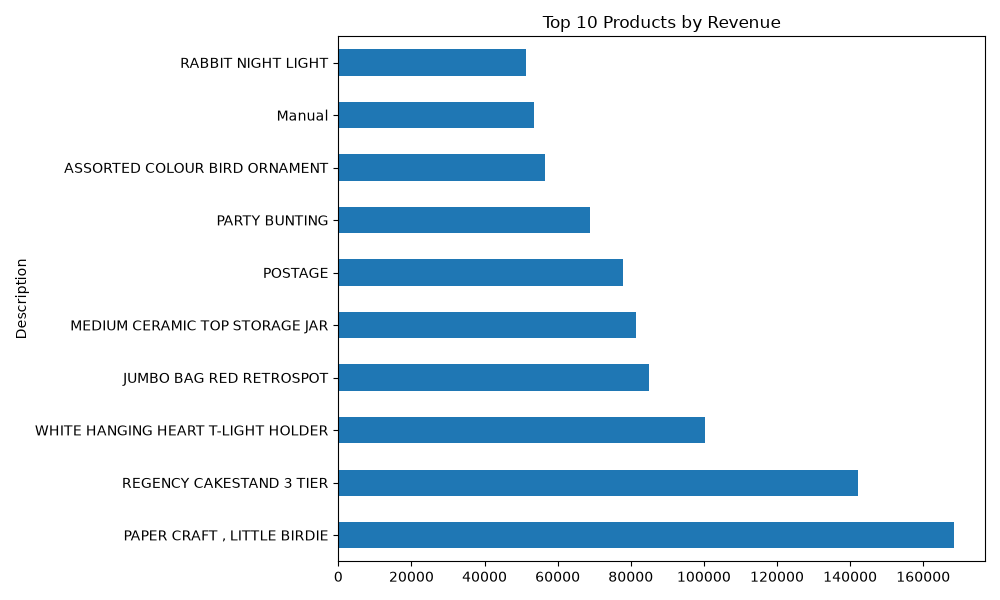
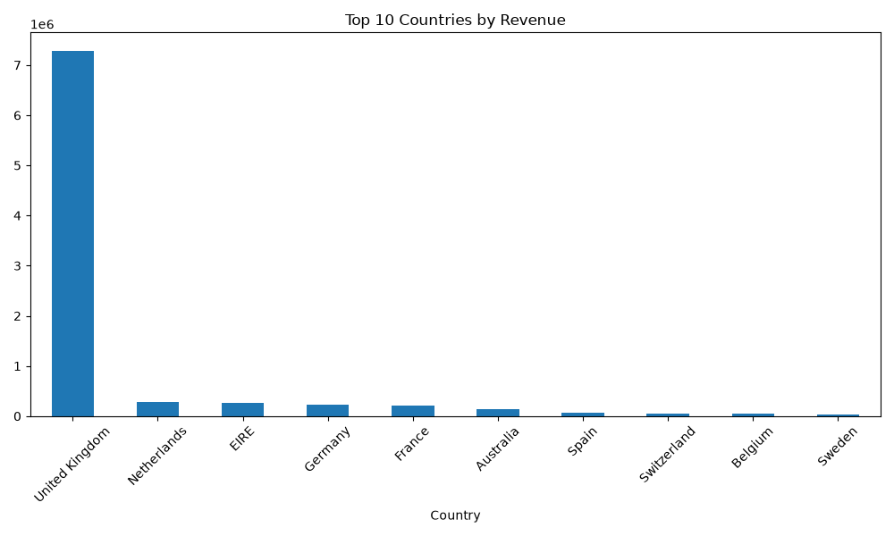

# E-Commerce Sales Analysis

## Business Problem
An e-commerce company wants to understand sales performance, top products, and geographic trends to optimize inventory and marketing strategy.

## Dataset
Online Retail Dataset (541,909 transactions, Dec 2010 – Dec 2011)

## Tools Used
- Python (Pandas, Matplotlib, Seaborn)
- Power BI
- Jupyter Notebook

## Key Insights
- **Total Revenue:** $8,887,208.89
- **Total Orders:** 18,532
- **Total Customers:** 4,338
- **Average Order Value:** $479.56
- **Top Country:** United Kingdom ($7.4M revenue, 84% of total)
- **Top Product:** PAPER CRAFT, LITTLE BIRDIE ($156K revenue)
- **Peak Month:** November 2011

## Data Cleaning Steps
- Removed 149,217 rows with missing CustomerID
- Removed rows with missing Description
- Removed cancelled orders (negative quantities)
- Removed zero/negative prices
- Created Revenue column (Quantity × UnitPrice)
- Extracted Year-Month for trend analysis

## Charts

## How to Run
1. Open `Project 1.ipynb` in Jupyter Notebook
2. Open Power BI dashboard file
